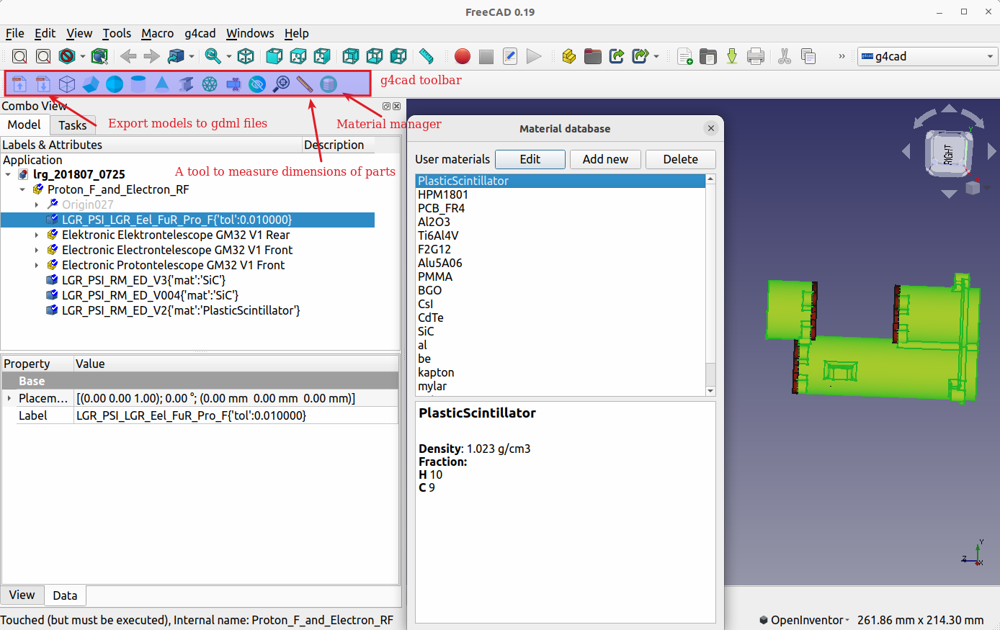

[](https://doi.org/10.5281/zenodo.7085915)
# G4CAD   - A freecad workbench for converting CAD files to gdml 

People usually spend most of the time developing mass model when developing a Geant4-based Monte Carlo simulation package. For simple geometries, it is relatively easy to describe them using CGS models. 
However, this becomes almost impossible for complex geometries. 
G4cad is an free, open source workbench for FreeCAD. Its features include

* Material management.  Users can define their own materials and set the predefined materials for different solids 
* Adding simple CGS models to existing CAD models
* Users can define the physical volume names for a solid
* Users can define tessellation tolerance for each individual solid
* Convert models to gdml files
* providing various tools useful for converting CAD models to gdml, like  measuring tools, tool to remove small parts

We also developed a web version, which can be found at the link http://polar.psi.ch/cadmc/

### Requirements
 Tested with FreeCAD 0.19, on both Ubuntu and Windows，  should also work with Freecad v0.16, v0.17 and v0.18


### Installation
1) Download g4cad https://github.com/drhlxiao/g4cad/archive/refs/heads/main.zip
2) Unzip the downloaded zip file
3) find the folder g4cad in unzipped folder, copy it to FreeCAD workbench directory (~/.FreeCAD/Mod on Linux. On windows, You can also find folder "Mod" under the installation directory)


### Typical Workflow

1) Open the step file to be converted 
2) click the icon "add world volume" in the toolbar to add a world volume 
3) Select a solid, set material
4) If the material you want is not in the list, open the user_materials.json with a text editor, add the information of the material
5) Select the solids to be exported
6) click the icon "Export solids to gdml files" to generate gdml files
7) If everything goes well, the gdml files are written to gdml/ in the specified folder and a log file can also be found in the folder.  
8) Reading gdml files in Geant4

Here is a code snippet 
```cpp
G4VPhysicalVolume* DetectorConstruction::Construct(){
G4String worldGdmlFilename="<GMLD_OUTPUT_PATH>/gdml/World.gdml"
G4GDMLParser parser;
parser.Read(worldGdmlFilename);
G4VPhysicalVolume *world= fParser.GetWorldVolume();     
//other code 
  return world;
}
 ```


### Cite this work
If you use g4cad in your work, please use the following citation,
```sh
@software{g4cad,
  author       = {Hualin Xiao, Wojtek Hajdas},
  title        = {{g4cad - A freecad workbench for converting CAD 
                   files to gdml}},
  month        = sep,
  year         = 2022,
  publisher    = {Zenodo},
  version      = {v1.0},
  doi          = {10.5281/zenodo.7085915},
  url          = {https://doi.org/10.5281/zenodo.7085915}
}
```

 ### Screenshots
 * g4cad Workbench

 *  view of the exported model in geant4


